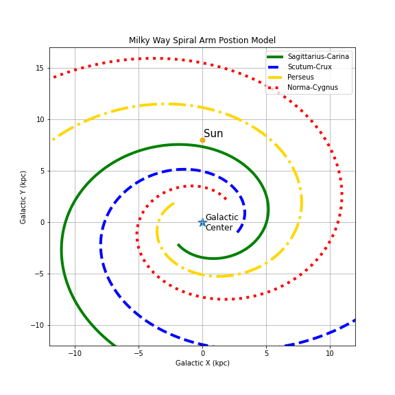
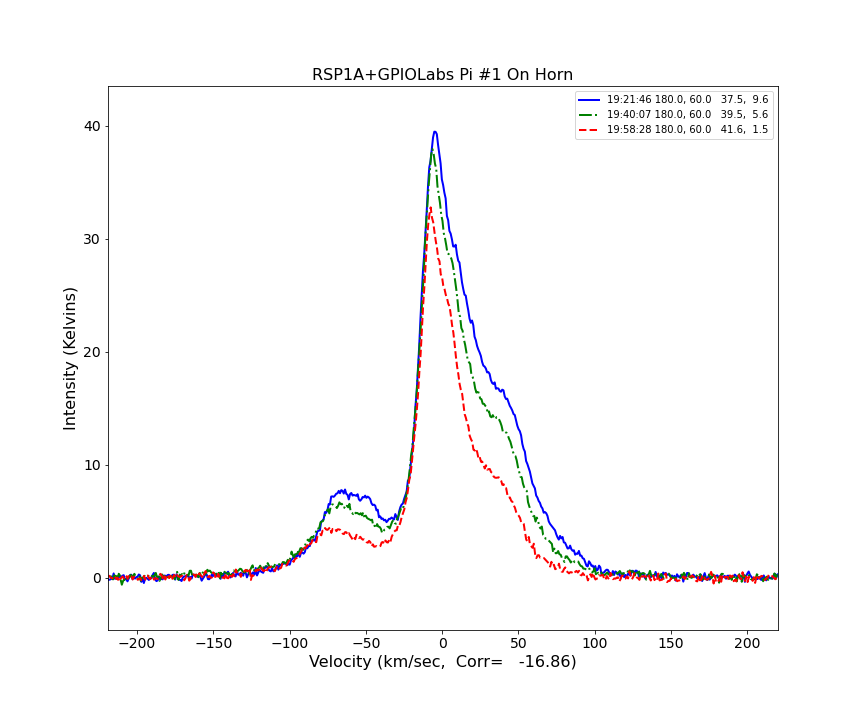

# jupyter
## Jupyter Notebooks for analyzing Horn Radio Astronomy Observations
### Glen Langston - National Scienc foundation - 2022 February 7

Here we provide a sequence of Aficionado/Student/Teacher/Hobbist projects.
These plotting and computing tools guide you in looking at your own ombservations.

You can update these tools to make discoveries with your own Horn Radio Telescopes.
Each of the Horn Telescopes use GnuRadio software designs to observe our Milky Way Galaxy.  Different versions of the software record different types measurements.

These notebooks assume the observations are taken using Gnuradio software systems available on GitHub.
Please see http://www.github.com/WVURAIL/gr-radio_astro for the software to make the observations.
These notebooks only work with NSF designs found there.

<h3> A notebook for each topic</h3> 
The Jupyter notebooks here work with the provided data.  You can edit these notebooks to work with your own observations.
We intend to have a notebook for each of our "Lessons".   Here are the first lessons:

<ol>
<li>
Model the Shape of the Milky Way:  <a href="https://github.com/glangsto/jupyter/blob/master/MilkyWayIntensityModel.ipynb">
  Milky Way Model</a>
  This notebook plots a model of the Milky Way spiral arms and makes simple model predictions for the hydrogen intensities.
  Running this model shows the Earth's location in the Milky Way model.  You can update this model.   The hydrogen intensity model has lots of room for improvement!
 
<li>Hydrogen, its everywhere!:  A days observations: 
  
  <a href="https://github.com/glangsto/jupyter/blob/master/MilkyWayPlotting.ipynb"> Horn Observations Plotting</a>.
  This notebook plots some previously collected observations.  This notebook can be modified to plot your own observations.
  Note if you are using , use this notebook instead 
  
</ol>

 

  

<h3> Other notebooks are placed in sub-directories to reduce clutter</h3>
<ol>
<li>
Software tools to convert from and to Comma separated value files to .ast and .hot files.
See <a href="https://github.com/glangsto/jupyter/blob/master/convert"> convert</a> directory
<li>
Software tools to compute average calibration spectra.
See <a href="https://github.com/glangsto/jupyter/blob/master/calibrate"> calibrate</a> directory
<li>
Tools to fit gaussians to parts of the spectra, so that arms of the Milky Way can be identified.
See <a href="https://github.com/glangsto/jupyter/blob/master/convert"> fit</a> directory

</ol>
 
  
<h3>How to build your telescope</h3>
  
The horn radio telescopes are student, teacher and hobbiest built radio telescopes that can easily observe our place in the Milky Way Galaxy.   The horns are funnels a few feet in diameter, which channel radio wavelength signals to amplifiers and software defined radios. 

The horn construction is described at www.WVURAIL.org

<h3>Python code in this project</h3>
  <ol>
    <li> ras.py -- Radio Astronomy Plotting Tools
    <li> radioastronomy.py -- Utilities for reading and writing horn radio astronomy data.
    <li> angles.py -- tools for reading and writing angles in different formats
    <li> gainfactor.py -- tools for computing the hot/cold load calibration.
    <li> rasnames.py -- tools for selecting radio astronomy data and finding the files in sub-directories.
    <li> jdutil.py -- convert dates to Jilian days and visa versa.
    <li> angular.py -- compute the angular distance between to coordinates
  </ol>
